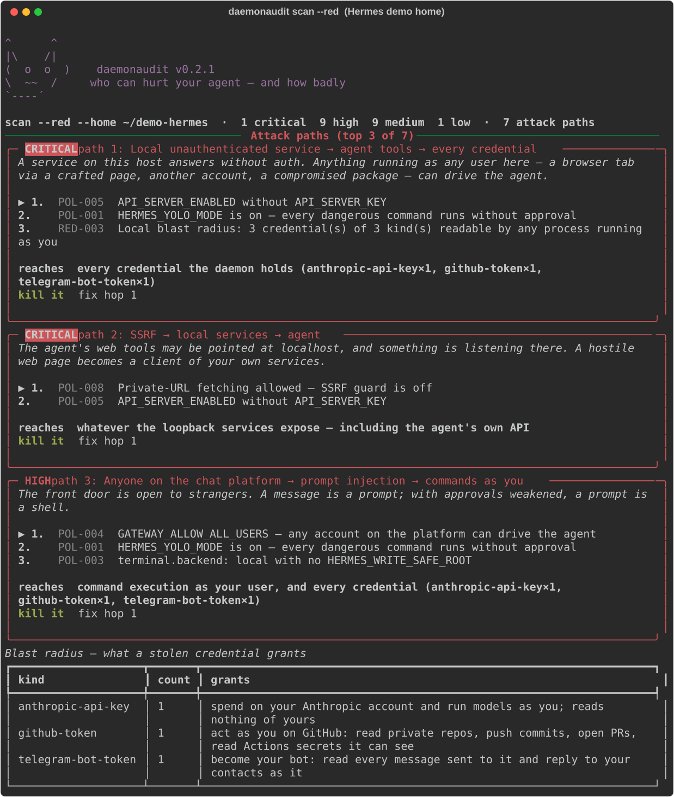
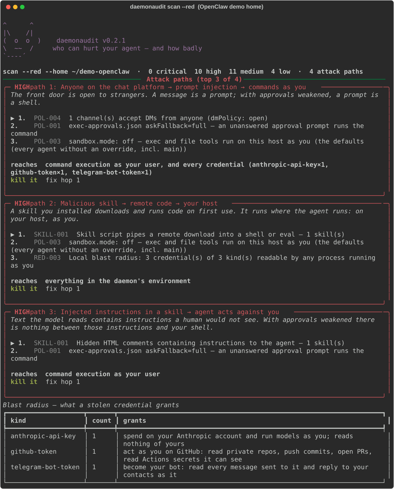

# daemonaudit

> Who can hurt your AI agent — and how badly.

`daemonaudit` is a red/blue security audit for self-hosted AI agent daemons. It finds the
secrets, the open doors and the weak policies on the machine your agent runs on, then tells
you the **attack paths** and the **blast radius**: what an attacker gets, from where, and
which single fix kills the whole chain.

Supports **Hermes Agent** and **OpenClaw**. Both are found automatically; a box running both gets one report. Generic MCP configs are on the roadmap.

## Install
```bash
uvx daemonaudit scan --red          # zero-install run
pipx install daemonaudit            # or: pip install daemonaudit
```
Requires Python ≥ 3.10. Dependencies: `psutil`, `rich`, `pyyaml`. Linux, macOS and Windows.
From a clone: `python -m pip install -e '.[dev]'`.

## What it looks like

| Hermes demo home | OpenClaw demo home |
|---|---|
|  |  |

*Both are `daemonaudit scan --red` against a deliberately-broken demo home with fake credentials — build your own with `python scripts/demo_home.py [--openclaw]`.*

## Why not just the built-in audit?
Framework auditors ask *"is my config right?"*. `daemonaudit` asks *"what does an attacker
standing here actually get?"* — and it looks at the **host**, not just the config: backups,
transcripts, sqlite state, process environments, listening sockets, and the skills you installed.
Then it **chains** the findings: an exposed port *plus* an unsandboxed backend *plus* keys in the
environment is one attack path, and it names the one hop whose fix breaks it.

## Use
```bash
daemonaudit scan                       # passive audit (safe anywhere): secrets, perms, policy, skills, listeners
daemonaudit scan --red                 # + active probes against THIS host, attack paths, blast radius
daemonaudit scan --html report.html    # a self-contained HTML report (also --json)
daemonaudit scan --home /path/to/.hermes      # or /path/to/.openclaw — the framework is recognised from the directory
daemonaudit checks                     # list every check (and which framework each implementation covers)
```
`--red` adds three probes that only ever touch **localhost**: it connects to the daemon's own
listeners to see which answer without a password, reads the daemon's process environment, and
reads the vault the way any process running as you could — to measure the real local blast radius.

## What it checks
21 checks in seven areas — **SEC** secrets outside the vault · **PERM** file permissions · **NET** listeners and sockets ·
**POL** policy (approvals, sandbox, who may talk to the agent, exposure, webhooks, debug leaks, content guards,
credential passthrough, literal secrets) · **SKILL** risky skills and context files · **ADV** freshness · **RED** localhost probes.
The same check id means the same class of weakness on every framework; each framework has its own implementation where the config differs.

<details>
<summary><b>Full check matrix — what each id reads on Hermes and on OpenClaw</b></summary>

| id | Hermes | OpenClaw |
|---|---|---|
| **SEC-001** secrets outside the vault | config, backups, `state.db`, transcripts, logs | `sessions/*.jsonl`, `state/openclaw.sqlite`, `agents/*/agent/models.json`, workspace, backups — vault files (`openclaw.json`, `.env`, `credentials/`, `auth-profiles.json`, `openclaw-agent.sqlite`, `devices/`) are never "sprawl" |
| **PERM-001/002/003** permissions | vault/state readable by others, weaker backups, writable/executable state | same, plus `$include` files and the gateway log in `/tmp/openclaw` |
| **NET-001/002** listeners & sockets | api server / webhook / CDP ports | gateway port (`gateway.port`, default 18789) and the browser control port |
| **POL-001** approval bypass | `HERMES_YOLO_MODE`, `HERMES_EXEC_ASK`, `--yolo` in units | `tools.exec` security=full + ask=off (incl. the trusted-operator default, graded MEDIUM), `exec-approvals.json` askFallback/autoAllowSkills, interpreters without `strictInlineEval` |
| **POL-002** approvals config | `approvals.mode`, cron/one-shot auto-approve, broad allowlists | broad exec allowlist patterns, `tools.elevated` wildcards, `/bash`, interpreters as `safeBins` |
| **POL-003** host execution | `terminal.backend: local` without a write root | `sandbox.mode: off` / `non-main` per agent scope (defaults and every `agents.list[]` override), `tools.exec.host` drift, dangerous Docker binds/network/seccomp |
| **POL-004** allow-all users | `*_ALLOW_ALL_USERS` | `dmPolicy: open`, `allowFrom: ["*"]`, `groupPolicy: open`, name matching, `session.dmScope: main` with several senders |
| **POL-005** exposed / unauthenticated service | API server host/key/CORS | `gateway.bind`, `gateway.auth.mode`, short tokens, Tailscale funnel, Control-UI device-auth/origins bypasses, trusted-proxy misconfig, `gateway.tools.allow`, node commands, mDNS full |
| **POL-006** webhooks & dashboard | WhatsApp/Telegram webhook secrets, dashboard auth | `hooks.token` missing/short/reused, `hooks.path: /`, caller-chosen session keys, Telegram/Zalo webhook secrets, admin-http-rpc without auth |
| **POL-007** debug leaks | redaction off, request dumps, OAuth trace, Langfuse | `logging.redactSensitive: off`, trace logging, `OPENCLAW_DEBUG_MODEL_PAYLOAD`, gateway token in a service unit, OTel export |
| **POL-008** content guards | private-URL fetch, tirith, project plugins | browser SSRF policy, `allowUnsafeExternalContent`, plugins without `plugins.allow`, prompt-injecting plugins, acpx approve-all |
| **POL-009** credential passthrough | `terminal.env_passthrough`, credential file mounts | master keys in `skills.entries.*.env` / internal hooks, credentials handed to the sandbox |
| **POL-010** literal secrets in config | `mcp_servers.*.env` | `mcp.servers.*.env`, plus every other literal credential in `openclaw.json` that could be a SecretRef |
| **SKILL-001** risky skills & context files | `~/.hermes/skills`, bundled-skill detection, `required_environment_variables` | every skill root OpenClaw loads (managed, workspace, `~/.agents/skills`, extra dirs, hooks), `metadata.openclaw.requires.env`, bundled skills from the npm package, all workspace context files |
| **ADV-001** freshness | `.update_check` cache, acked advisories | `update.checkOnStart`, `security.audit.suppressions`, CLI/config version drift |
| **RED-001/002/003** probes | unauthenticated HTTP, process env, vault | same; the Control UI / `/health` paths are expected to answer anonymously and are reported as such, not as findings |

</details>

Where OpenClaw's own `openclaw security audit` has a matching checkId, the finding names it. daemonaudit adds what that audit does not look at: the host (transcripts, sqlite, backups, process environments, listeners), the skills you installed, and the chaining into attack paths.

Each finding says **why it matters**, the exact **fix**, and a command to **verify** it.

## Principles
- **Read-only.** It never changes your system.
- **Zero network egress.** Nothing leaves the box. The active probes connect to localhost only, and refuse any target that isn't this host.
- **Redacted by construction.** The report can show you `sk-ant-…4f2a`; it cannot show you the key. Nothing that leaves the process — terminal, JSON, HTML — contains a raw credential.
- **No false passes.** A check that can't run says *skipped*, never *ok*. A config file that doesn't parse skips every check that reads it — it never evaluates defaults and calls them a pass. A scan that couldn't complete exits non-zero.

## Exit codes (for cron / CI)
| code | meaning |
|---|---|
| 0 | clean, and every check completed |
| 1 | findings (low/medium) |
| 2 | high or critical findings |
| 3 | no supported daemon found (use `--home`) |
| 4 | no findings, but a check was skipped/errored/incomplete — **not** a clean bill |
| 5 | the tool itself failed (`--debug` for a scrubbed traceback) |

Precedence 2 > 1 > 4 > 0. INFO-only findings don't affect the exit code.

## Roadmap
- **v0.1** — Hermes: secrets, permissions, policy, skills, exposed services, localhost red probes, attack-path report. Linux · macOS · Windows.
- **v0.2** — OpenClaw adapter: same checks, same attack-path rules, both daemons in one report. **v0.2.1** closes the "config doesn't parse → pass" hole on both frameworks and aligns `$include`, config-path and per-agent sandbox handling with OpenClaw's own rules ([CHANGELOG](CHANGELOG.md)).
- **next** — generic MCP config adapter, traversal-aware permission grading, the framework's own executable tree, canary-injection probe, local-LLM (Ollama) semantic skill review, guided remediation with rollback, richer Windows ACL model, continuous monitoring / drift alerts.

## Development
`pytest` runs the suite (Linux/macOS/Windows in CI). The design invariants live in
[`AGENTS.md`](AGENTS.md); the plan and history in [`BUILD.md`](BUILD.md); releases in
[`CHANGELOG.md`](CHANGELOG.md). Built with a two-model workflow — one model builds, another reviews
and writes adversarial fixtures; the review rounds are under [`reviews/`](reviews/).

## License
MIT — see [LICENSE](LICENSE).
